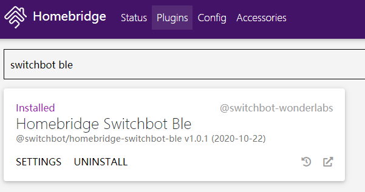

<span align="center">

<a href="https://github.com/homebridge/verified/blob/master/verified-plugins.json"></a>

# @switchbot/homebridge-switchbot-ble

[](https://www.npmjs.com/package/@switchbot/homebridge-switchbot-ble)
[](https://www.npmjs.com/package/@switchbot/homebridge-switchbot-ble)

</span>

The @switchbot/homebridge-switchbot-ble is a nodejs module , and also a homebridge plug-in that directly controls SwitchBot products via BLE.

Now supports:

- [SwitchBot (Bot)](https://www.switch-bot.com/products/switchbot-bot)
- [SwitchBot Curtain (Curtain)](https://www.switch-bot.com/products/switchbot-curtain)
- [SwitchBot Thermometer & Hygrometer (Meter)](https://www.switch-bot.com/products/switchbot-meter)

## Installation

### Installing bluetooth libraries

##### Ubuntu, Debian, Raspbian

```sh
sudo apt-get install bluetooth bluez libbluetooth-dev libudev-dev
```

See the document of the [@abandonware/noble](https://github.com/abandonware/noble#readme) for other operating systems details.

### Installing package

```sh
sudo npm install -g @switchbot/homebridge-switchbot-ble
```

You can also install it on the homebridge plugins page.


## Configuration

Add this to your homebridge `config.json` file

```json
"platforms": [
    {
        "platform": "SwitchBotPlatform",
        "name": "SwitchBotPlatform"
    }
]
```

If it work, add devices.

```json
"platforms": [
    {
        "platform": "SwitchBotPlatform",
        "name": "SwitchBotPlatform",
        "devices": [
            {
                "type": "bot",
                "name": "Bot 2c",
                "bleMac": "d4:cc:43:97:ae:2c"
            },
            {
                "type": "bot",
                "name": "Bot 51",
                "bleMac": "e7:4d:36:cf:9e:51",
                "scanDuration": 2000
            },
            {
                "type": "curtain",
                "name": "Curtain 11",
                "bleMac": "ec:58:c5:d0:01:11",
                "scanDuration": 2000,
                "reverseDir": false,
                "moveTime": 2000
            },
            {
                "type": "meter",
                "name": "Meter 84",
                "bleMac": "d0:d5:64:14:43:84",
                "scanDuration": 5000,
                "scanInterval": 60000
            }
        ]
    }
]
```

**Requird Settings**

- `devices` - SwitchBot devices list.
- `type` - Device type. Currently supports `bot`, `curtain` and `meter`.
- `name` - Device name.
- `bleMac` - Device mac address. You can find it in App settings.

**Optional Settings**

- `scanDuration` - Scan timeout. BLE Central must first scan the advertising. Default is `1000`(unit: ms). Longer time to ensure device discovery but slower response.
- `reverseDir` - Set to `true` to exchange the "opened" and "closed" directions of Curtain after calibration. Default is `false`. So you can swap the directions without recalibration.
- `moveTime` - Set the actual running time of Curtian, which is also the time to switch from running state to opened/closeed state in the Home APP. Default is `2000`(unit: ms).
- `scanInterval` - Scan interval. Currently indicates the cycle of updating the temperature and humidity value of Meter. Default is `60000`(unit: ms).

Please note that:

1. The device `name` cannot be the same.
2. Restart HomeBridge after updating the config file.
3. The "opened" and "closed" directions of HomeKit are the same as those in Curtain and SwitchBot APP, but the percentage definitions are different. "Closed" is 0% in HomeKit but 100% in Curtain and APP.

## Community

- [SwitchBot (Official website)](https://www.switch-bot.com/)
- [Facebook @SwitchBotRobot](https://www.facebook.com/SwitchBotRobot/)
- [Twitter @SwitchBot](https://twitter.com/switchbot)
